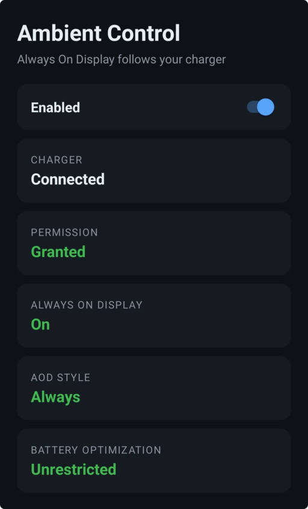

# AmbientControl

An Android application that automatically activates Ambient/Always-On display while your phone is charging.



> [!NOTE]
> **AI Notice**
> This project was updated for newer phones by Claude, in 2026

## Installation

You have to build it and install it.

This was never uploaded to the PlayStore, since on most devices it requires a permission you can only grant through ADB.

### Building

You'll need the Android SDK (compile SDK 33) and a device running Android 7.0 (API 24) or later.

```
$ ./gradlew assembleDebug
```

The APK ends up in `app/build/outputs/apk/debug/app-debug.apk`. Since there's no PlayStore version, there's no signed release build either.

### Installing

With USB debugging enabled on your device:

```
$ ./gradlew installDebug
```

Or install the APK directly:

```
$ adb install app/build/outputs/apk/debug/app-debug.apk
```

Then grant the required permission (next section).


### Granting permissions

Permissions depend on the device.

#### One UI (Samsumg 2026)

Grant the "Modify System Settings" permission. It should be offered on first launch, and can be reached via System Settings manually under `Settings > Apps > Special app access`.

The _Always-On Display_ is toggled with charging state, **but the mode when enabled must be still set by you** (the intended is _Always_).

#### Stock Android (Older Pixels and other AOSP devices)

Ambient display is controlled by the `doze_always_on` secure setting, which requires a
permission you can only grant through ADB:

```
$ adb shell pm grant io.slezica.ambientcontrol android.permission.WRITE_SECURE_SETTINGS
```

Works on my machine (tm).

